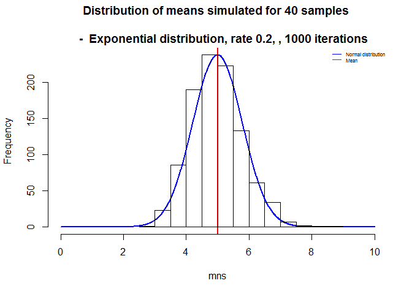
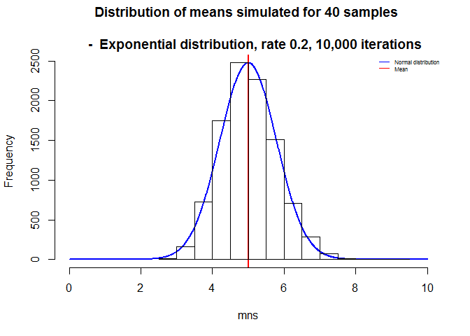
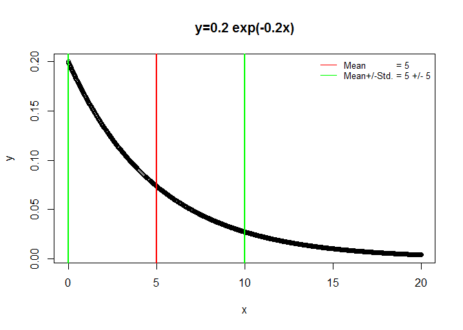
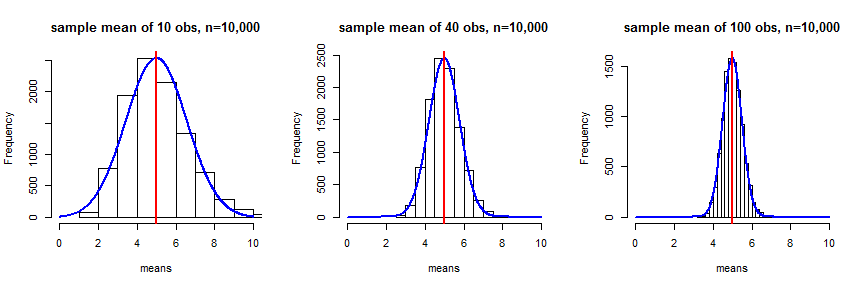

# Central Limit Theorem - Exponential distribution
SNB  
We wish to demonstrate that the **Central Limit Theorem** (CLT) holds also in the case of the 
the exponential distribution with rate constant, $\lambda$, given by:
$$f(x) = \lambda e^{- \lambda x}
$$
(for  x equal or larger than 0).
It follows for its mean and standard deviation:
$$\mu = \sigma = 1/\lambda
$$

To be shown is therefore:
where $\bar X_{ns}$ are the averages of the ${ns}$ samples of the distribution, that the distribution
$\frac{\bar X_{ns} - \mu}{\sigma / \sqrt{ns}}$ approaches a standard normal distribution for large $ns$.

From inference theory with large ${ns}$ $$\frac{\bar X_{ns} - \mu}{\sigma / \sqrt{ns}} = 
    \frac{\mbox{Estimate} - \mbox{Mean of estimate}}{\mbox{Std. Err. of estimate}}.
$$

In other words the averages of the large number of sample are distributed normally 
with their estimate mean and standard error as parameters. 

# Specifically

For $\lambda = 0.2$, we have then $\mu = 5$ and $\sigma = 5$.
(Se Appendix A for graph.)
We are to investigate the exponential distribution using $ns = 40$ samples.
(The effect of increased $ns$ can be seen in Appendix B for $ns = 10,40,100$)

The distribution of averages given by
$$
    \frac{\bar X_{40} - 5}{5/\sqrt{40}}
$$ 
should, according to the Central Limit Theory, approximately be close to the standard normal distribution 
or equivalently, the distribution $\bar X_{40}$ is close to a normal distribution with mean 5 and standard deviation 5. 

# Simulation of the mean of 40 observations

Taking the random exponential distribution in R $rexp[40)$ for the 40 samples and a total of $n = 1000$ repetitions of  
the sample averages, we create a distribution of means and calculate their mean and standard deviation, as follows:


```r
    mns  <- NULL
    for (i in 1 : 1000) 
        {mns = c(mns, mean(rexp(40,0.2)))}
    mean_40 <- mean(mns)
    var_40  <- var(mns)
    std_40 <- sqrt(var_40*40)
cat("Thus the simulation approximates the mean of 5 by ",mean_40," and the standard deviation of 5 by ",std_40,".") 
```

```
## Thus the simulation approximates the mean of 5 by  4.972658  and the standard deviation of 5 by  5.194309 .
```
The simulated mean and variation times 40 (or standard deviation) the square root of 40) are close to the 
the theoretical mean of 5 and standard deviation of 5 (variance of 25).
The plots of both simulated and theoretical density distribution are centred around 5, and the shape approximately the same.

```r
    x   <- seq(0,10, length = 1000)  
    y   <- dnorm(x,mean=5, sd=5/sqrt(40)) 
    plot(x,y, ann=F, axes=F, type="l", lwd=2, col="blue")
    abline(v=5.0, col="red",lwd=2)
    par(new=TRUE)
    hist(mns, xlim=c(0,10), main="Distribution of means simulated for 40 samples \n 
    -  Exponential distribution, rate 0.2, , 1000 iterations")
    legend("topright",legend=c("Normal distribution", "Mean"),col=c("blue","red"),lty=c(1),cex=0.5, bty="n")
```

 
 
Repeating this computation with $rexp[40)$ for the 40 samples and a total of $n = 10000$ repetitions of  
the sample averages:


```
## The result both for the mean  5.014687  and the standard deviation  4.977134  are closer to the population values.
```

 
Again the simulated and the theoretical distributions are very close, with an indication that with increasing iterations
they are expected eventually to overlap within the plotting scale chosen.

# APPENDIX A
The exponential distribution has this appearance:


```r
x=seq(0,20,length=1000)
y=dexp(x,rate=0.2)
plot(x,y)
title("y=0.2 exp(-0.2x)")
abline(v=5,col="red",lwd=2)
abline(v=c(0,10),col="green",lwd=2)
legend("topright",legend=c("Mean           = 5","Mean+/-Std. = 5 +/- 5"),col=c("red","green"),lty=c(1),cex=0.8, bty="n")
```

 

# APPENDIX B
Increasing the sample size, {ns}, improves the approximation to the mean and standard deviation:

```
## ns = 10 , mean estimate =  5.03226 , standard error =  5.068317 .
## ns = 40 , mean estimate =  4.992505 , standard error =  5.01328 .
## ns = 100 , mean estimate =  4.998442 , standard error =  4.989977 .
```

 
