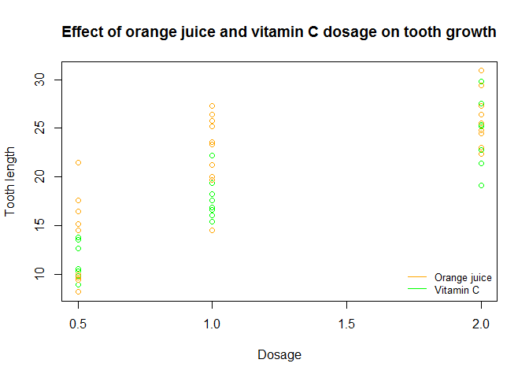
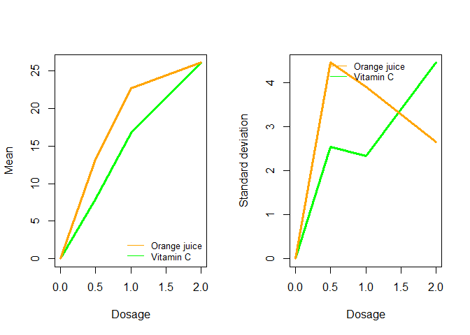

# Confidence Limits of Tooth Growth Data
SNB  
The data for testing the effect of two sources of Vitamin C on growth of guinea pig teeth
are available in the "datasets" library as [ToothGrowth](https://stat.ethz.ch/R-manual/R-devel/library/datasets/html/ToothGrowth.html) 

The required library (datasets) and data set TG (ToothGrowth) are loaded 

```
## 
## Attaching package: 'dplyr'
## 
## The following object is masked from 'package:stats':
## 
##     filter
## 
## The following objects are masked from 'package:base':
## 
##     intersect, setdiff, setequal, union
```

```r
    TG <- ToothGrowth
```
#Exploring and analysing the data set:


```r
    str(TG)
```

```
## 'data.frame':	60 obs. of  3 variables:
##  $ len : num  4.2 11.5 7.3 5.8 6.4 10 11.2 11.2 5.2 7 ...
##  $ supp: Factor w/ 2 levels "OJ","VC": 2 2 2 2 2 2 2 2 2 2 ...
##  $ dose: num  0.5 0.5 0.5 0.5 0.5 0.5 0.5 0.5 0.5 0.5 ...
```

```r
    summary(TG)
```

```
##       len        supp         dose      
##  Min.   : 4.20   OJ:30   Min.   :0.500  
##  1st Qu.:13.07   VC:30   1st Qu.:0.500  
##  Median :19.25           Median :1.000  
##  Mean   :18.81           Mean   :1.167  
##  3rd Qu.:25.27           3rd Qu.:2.000  
##  Max.   :33.90           Max.   :2.000
```

```r
    OJ <- select(subset(TG,supp=="OJ"),dose, len)
    VC <- select(subset(TG,supp=="VC"),dose, len)
    oj <- summarise(group_by(OJ,dose),mean=mean(len),sd=sd(len))
    vc <- summarise(group_by(VC,dose),mean=mean(len),sd=sd(len))
    
    plot(VC$dose,VC$len,col="green",pty=40,xlab="",ylab="",axes=FALSE,
        main="Effect of orange juice and vitamin C dosage on tooth growth")
    par(new=TRUE)
    plot(OJ$dose,OJ$len,col="orange",pty=40,xlab="Dosage",ylab="Tooth length")
    legend("bottomright",legend=c("Orange juice", "Vitamin C"),col=c("orange","green"),lty=c(1),cex=0.8, bty="n")
```

 

```r
    oj
```

```
## Source: local data frame [3 x 3]
## 
##   dose  mean       sd
## 1  0.5 13.23 4.459709
## 2  1.0 22.70 3.910953
## 3  2.0 26.06 2.655058
```

```r
    vc
```

```
## Source: local data frame [3 x 3]
## 
##   dose  mean       sd
## 1  0.5  7.98 2.746634
## 2  1.0 16.77 2.515309
## 3  2.0 26.14 4.797731
```

```r
    origin <-c(0,0,0)
    oj <- rbind(origin, oj)
    vc <- rbind(origin, vc)
    
    par(mfrow = c(1, 2))
    plot(vc$dose,vc$mean,col="green", type="l", lwd= 3, xlab="",ylab="",axes=FALSE)
    par(new=TRUE)
    plot(oj$dose,oj$mean,col="orange",type="l", lwd=3, xlab="Dosage",ylab="Mean")
    legend("bottomright",legend=c("Orange juice", "Vitamin C"),col=c("orange","green"),lty=c(1),cex=0.8, bty="n")
    plot(vc$dose,vc$sd,col="green", type="l", lwd= 3, xlab="",ylab="",axes=FALSE)
    par(new=TRUE)
    plot(oj$dose,oj$sd,col="orange",type="l", lwd=3, xlab="Dosage",ylab="Standard deviation")
    legend("top",legend=c("Orange juice", "Vitamin C"),col=c("orange","green"),lty=c(1),cex=0.8, bty="n")
```

 

```r
    oj <- oj[2:4,]
    vc <- vc[2:4,]
```

*Preliminary conclusion *:

    Although the absolute increase in growth is greater with orange juice for each dosage, the variance of each
    measurement of the growth due to orange juice decreases with dosage, while it increases by large for the 
    measurement of the effect of vitamin C. The inference that orange juice is generally more effective than 
    vitamin C supplement cannot be made definitely without remarking that:
    
    1) the small sample size of 3 dosage levels limits general estimation of the effect of increasing dosage 
       for each of the two supplements,
 
    2) the relatively large standard error in the growth means for each dosage makes comparison of the real 
       effect of the two supplements less clear .

    We use t-tests to see how justified this conclusion is: orange juice supplement increases tooth growth more than
    vitamin C.
    
#Comparing the statistics of the two trials:

Both sets of data are assumed to be measured from the same base line of no supplement.

**Assumptions**:

The two groups with different supplements are assumed independent, since the test subjects cannot take the same 
supplement (without changing the base line).The variance in the two sets of data are also obviously different.

Two different approaches to the statistical inference may be the following:

*Case 1*
The different means of the rate of increase, *growth per mg supplement/day*, three for each supplement can be
compared as independent sample sets for each supplement. 

We begin again with the 3 means for each supplement and calculate the effect per dosage, take their means
and standard deviation of the two (independent) distributions:


```r
    oj_rate <- mutate(oj, mean_inc=mean/dose)
    vc_rate <- mutate(vc, mean_inc=mean/dose)

    oj_rate
```

```
## Source: local data frame [3 x 4]
## 
##   dose  mean       sd mean_inc
## 1  0.5 13.23 4.459709    26.46
## 2  1.0 22.70 3.910953    22.70
## 3  2.0 26.06 2.655058    13.03
```

```r
    vc_rate
```

```
## Source: local data frame [3 x 4]
## 
##   dose  mean       sd mean_inc
## 1  0.5  7.98 2.746634    15.96
## 2  1.0 16.77 2.515309    16.77
## 3  2.0 26.14 4.797731    13.07
```

```r
    oj_mean <- mean(oj_rate$mean_inc)
    oj_sdev <- sd(oj_rate$mean_inc)
    vc_mean <- mean(vc_rate$mean_inc)
    vc_sdev <- sd(vc_rate$mean_inc)
    
cat("The results for orange juice: mean ",oj_mean,"(per mg/dag) and standard deviation ",oj_sdev,".") 
```

```
## The results for orange juice: mean  20.73 (per mg/dag) and standard deviation  6.92834 .
```

```r
cat("The results for vitamin C: mean ",vc_mean,"(per mg/dag) and standard deviation ",vc_sdev,".") 
```

```
## The results for vitamin C: mean  15.26667 (per mg/dag) and standard deviation  1.945002 .
```
The T test for the independent trials is therefore:

```r
t.test(oj_rate$mean_inc,vc_rate$mean_inc,paired=FALSE, var.equal=FALSE)$conf.int
```

```
## [1] -10.28206  21.20873
## attr(,"conf.level")
## [1] 0.95
```
Since the confidence interval includes zero, the evidence for the higher effect of orange juice is not conclusive, 
for the analysis taking all over all dose rates.

This inspires an analysis of the differences in the two supplements (again considered independent) for each dosage.
 
*Case 2*:

Separating the dose rates data for each supplement:


```r
OJdose05<-select(subset(TG, dose==0.5 & supp=="OJ"),len)
VCdose05<-select(subset(TG, dose==0.5 & supp=="VC"),len)
OJdose10<-select(subset(TG, dose==1.0 & supp=="OJ"),len)
VCdose10<-select(subset(TG, dose==1.0 & supp=="VC"),len)
OJdose20<-select(subset(TG, dose==2.0 & supp=="OJ"),len)
VCdose20<-select(subset(TG, dose==2.0 & supp=="VC"),len)
DoseSet<- cbind(OJdose05, VCdose05,OJdose10, VCdose10, OJdose20, VCdose20)
names(DoseSet) <- c("OJdose05", "VCdose05","OJdose10", "VCdose10", "OJdose20", "VCdose20")
rownames(DoseSet) <-NULL
DoseSet
```

```
##    OJdose05 VCdose05 OJdose10 VCdose10 OJdose20 VCdose20
## 1      15.2      4.2     19.7     16.5     25.5     23.6
## 2      21.5     11.5     23.3     16.5     26.4     18.5
## 3      17.6      7.3     23.6     15.2     22.4     33.9
## 4       9.7      5.8     26.4     17.3     24.5     25.5
## 5      14.5      6.4     20.0     22.5     24.8     26.4
## 6      10.0     10.0     25.2     17.3     30.9     32.5
## 7       8.2     11.2     25.8     13.6     26.4     26.7
## 8       9.4     11.2     21.2     14.5     27.3     21.5
## 9      16.5      5.2     14.5     18.8     29.4     23.3
## 10      9.7      7.0     27.3     15.5     23.0     29.5
```
We calculated the T-interval for each dosage level:

```r
T05 <- t.test(OJdose05, VCdose05,paired=FALSE, var.equal=FALSE)$conf.int
T10 <- t.test(OJdose10, VCdose10,paired=FALSE, var.equal=FALSE)$conf.int
T20 <- t.test(OJdose20, VCdose20,paired=FALSE, var.equal=FALSE)$conf.int
rbind(T05,T10,T20)
```

```
##          [,1]     [,2]
## T05  1.719057 8.780943
## T10  2.802148 9.057852
## T20 -3.798070 3.638070
```

These intervals confirm that orange juice is only appreciably and unconditionally more effective than vitamin C
supplement for the two lower dose rates (as the plots clearly show) and that the effect for the highest dose,
2.0 mg/day, isn't conclusively larger with orange juice.

This also explains the result in Case 1 where the entire set of dose rates are included in the single t-test, where the 
highest dose rate is dominating.
